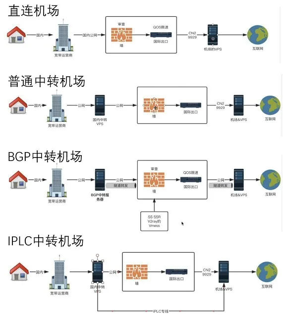

## 一、机场入门科普

### 机场是什么？机场和VPN什么关系？哪个好？

VPN 全名叫虚拟专用网络(Virtual Private Network)，一般叫代理，不是特定指翻墙的代理，很多公司或者学校都有 VPN，方便在公司或者学校外连接公司或者学校内部的网络。
后面一般大家慢慢把翻墙VPN简化叫 VPN， 谷歌搜出来的一般会被推荐买 express VPN 、nordVPN等这几家，狗皮膏药一样广告到处都是，非常不建议，不如机场。

机场是后来才出现的，专为翻墙而生，其实就是买了很多条 VPS 线路搭建了 SS、SSR、vmess等协议卖给别人用的，一般需要搭配代理软件使用，比如 Clash、小火箭、v2rayN、QuantumultX等。也有部分机场会提供一键客户端，大多数都是 clash 套壳的。现在市面上的很多 vpn 很多也是机场套壳。

严格意义来讲，VPN是网络层层面的代理，比如wireguard；我们常用的机场，一般使用ss、ssr、troan、vmess则是http是应用层、 socks则是会话层。

### 为什么叫机场？

因为一开始搭建的线路都是Shadowsocks，然后Shadowsocks软件是个小飞机。

### 什么是专线、隧道和中转、BGP、前置？

#### 1）为什么要中转不直连？

从您的设备直接传输数据到国外的代理服务器，路线图可以表示为 用户—–代理服务器

这种方式的缺点也显而易见，每个用户的网络环境都各不相同，连接至代理服务器的速度也会产生很大差别，无法保证用户的使用体验！同时当大量用户访问这台代理服务器的时候，长城防火墙会检测到异常，并将这台服务器拉黑屏蔽，完全无法保证用稳定性！但是因为成本低廉，大部分低端机场会采用这种方案。

因为直连非常容易被封IP和端口，且普通线路公网出境速度慢。特别是电信网络。买回国优化线路贵。

#### 2）什么是中转？

中转就是使用一个国内的（也可能是国外的，大部分是国内）服务器，把代理流量转发到落地机子。而且经过出境优化好的中转，走好的线路出去，速度更快，且不容易被墙。比如广东移动和联通，访问境外网络比电信好非常多，中转一下电信就能跑满G口而且无视线路。

普通中转节点
从您的设备传输数据到机场国内的数据中心，再由数据中心发送至国外的代理服务器，线图可以表示为 用户—–国内中转机——代理服务器
机场一般都会选用数据中心的机器作为国内的中转机，这种机器一般都会有网络优化且直接对接国际网络出口，因此可以一定程度上优化用户国内的访问延迟。但是这种方案也存在一定弊端，它无法保证所有代理服务器到中转机的线路是通畅快速的。

##### 为什么公网中转过墙不会被墙？

其实也会被墙。只是很多中转隧道的协议可以没这么快被墙。先被通报了。也可能是因为使用的私有协议。

#### 3）什么是隧道？

隧道就是指的买一个国内服务器当入口，比如广东移动。再买一个境外的服务器，比如香港CMI，然后对你代理的流量进行转发，从广东移动入口，经过一层 TLS 加密，到香港 CMI,解密，然后发送到代理流量到落地机，比如美国。为什么要隧道，因为中转也可能会被墙，走隧道相对安全一点。其实也是公网中转。

从您的设备传输数据到国内的数据中心，再由数据中心传输至国外的数据中心，国外的数据中心再将数据发送至代理服务器。 线路图可以表示为 用户—-国内中转机—–国外中转机—-代理服务器

#### 4）什么是专线？

其实说白了就是从 A 到 B 专门拉的网线。比如深港专线就是深圳到香港专门的线路，不走公网。本质其实也是中转。
专线好处就是不过墙。因为不走公网，延迟也低。
IEPL和 IPLC什么区别？IPLC（International Private Leased Circuit，国际私有租用线路）是端对端，是真正的专线；
而IEPL：国际以太网专线（International Ethernet Private Line）是端对端/多端, 是二层以太网。
一般机场买的是IEPL,比IPLC便宜，但是翻墙足够使用了。专线缺点是贵，如果不能保证使用流畅，专线体验是不如公网中转的。个人不用太在意是否是什么专线，稳定和速度快用着舒服就行。

常见的专线线路：
常见的深港IEPl、广港IEPL、沪日IEPL、优刻得、阿里云等等。区别也没很大。
只有在广东用广港专线连香港落地节点才会明显感觉到丝滑。到内陆就体验不大出来了。大部分人用专线和公网中转用不出区别。

#### 5)什么是BGP？

BGP：边界网关协议（Border Gateway Protocol）：BGP是运行于TCP上的一种自治系统（AS）的路由协议，是能够妥善处理不相关路由域间的多路连接的协议。BGP协议主要用于互联网AS（自治系统）之间的互联。
简单说：电信、联通等其他的大型IDC运营商都拥有自己的AS自治域号，不同运营商线路之间访问速度比较慢，比如：托管在电信机房的服务器，联通用户访问速度比较慢；如果服务器是BPG线路，无论用户使用电信、联通、移动或者其他线路，都可以无故障且快速的访问服务器；BGP能够控制路由的传播和选择最优的路由。（这段是抄的）

#### 6)什么是前置？

就是中转入口前再加一台国内机器当做入口。目的是为了抗通报的。什么的通报？通报就是被政府发现你用国内机器翻墙了，发通告让机房关了这台机器不让你翻了。

#### 7)什么是转发？

转发就是就是一堆国内中转机子。有些机场体量小，可能会买转发和别人共享中转机子。一个中转几千块，有些小机场买不起。你买机场，机场去买中转。本质都是给IDC和支付打工的。

但是有些机场拿隧道冒充专线。同时专线不一定好用。比如几万个客户，就1G带宽专线，体验就会非常糟糕。如果高速公路虽然快，但是人多了也堵。还不如公网中转了。所以不管什么线路，最主要的是带宽要够大！只有够大了才好用。然后就是稳定性，不稳定老断再快也难受。稳不稳定，主要是看机场主买的上游怎么样了。上游 IDC 如果不稳定，机场主也没办法，只能换一家。至于流媒体解锁，机场一般都是买的 DNS解锁商的服务，主要就是为了解锁奈飞。

总之：
直连线路：就是从你的设备直接访问各地区的服务器。
隧道线路：从你的设备访问一个国内的中转服务器，然后通过隧道加密的方式，到达各地区的服务器，相对来说，更安全。
IEPL专线：从你的设备通过专线的方式访问各地的服务器。专线的线路是不过墙的，理论上来说，绝对安全。同时，IEPL专线拥有更低的延迟，体验更棒。

总结：相同带宽下，总体线路质量：**IEPL专线中转 > 隧道中转 > 普通公网中转比如广东移动、湖南联通 > 直连。**
在保证能流畅看视频前提下，稳定性最重要。机场比的是钞能力，速度要看机场的总带宽大小。稳定要看机场的资源质量，主要是看机场主的上游的线路质量，解锁看的是机场主的落地/解锁商是否优秀。同上还拼谁修的快，炸的少，服务好。不过只要使用体验好，不用管是什么线。

机场线路图，图中可能有点问题但是整体是对的

#### 8)为什么不大推荐使用转发的机场？

一般用转发的都是小机场。因为买不起中转机。

转发很大问题在于速度和稳定性不足。
速度：不知道开转发的接受了多少个机场，每个机场下面又有很多用户使用，很可能晚上就挤了。
稳定性：其中某一个机场被人ddos，这个转发下的机场都遭殃。

怎么区分一家机场是否接入了的是转发？

看晚高峰速度和延迟、看是否有很多种中转入口线路。一般机场可能就两三条中转。

#### 9)怎么区分是否真专线

很难区分。有些机场使用的比较好的中转机子，延迟很低。看着和专线一样，但是特殊时期可以看得出。大家都是公网中转出问题了，你的也出问题了，大概率是假的专线。延迟高肯定是假专线。

#### 10）专线和公网对比：

都是国内机子中转，主要是怎么出海

专线相比公网优点：内网出海不绕路所以延迟低。

专线的主要缺点是价格昂贵，性价比不高。大约贵三倍左右，且大多数专线的接入点都位于广东（主要是广州和深圳）或上海，而上海的出口很少机场购买，价格也非常高。因此，大多数机场无法负担大带宽的专线费用。而公网中转机价格便宜，机场运营方也更愿意选择，带宽大，满足日常需求。

公网也有缺点，就是不会那么稳定，原因有：

1.出口异常：国内的出海流量通常通过广东和上海出口。上海公网出口偶尔会出现问题，导致速度跑不满。前几年，广东的出口也曾出现问题，流量被绕道到上海，造成延迟大幅上升。

2.对端问题：公网流量通常不直接连接到最终落地的节点，而是通过AWS（全球路由优化）中转。但AWS的路由有时会绕道，影响速度，且大多数情况下并未使用正价的AWS服务，这也导致了不稳定。

3.转发接入：许多小型机场并不会自己购买中转设备，而是通过其他机场的转发服务接入。通常一个转发节点会连接多个机场。如果该转发节点遭遇攻击或故障，所有连接的机场都会受到影响。由于专线价格过高，大多数转发服务会选择接入公网中转，而非专线接入。

4.政策，比如通告等等。当然专线入口也会。

当然不管是专线还是公网，国内机器或者境外对端任何一个出问题都一样会出问题。

### 为什么大部分中转机场基本都是ss协议？

一般中转机场使用ss，目前trojan也不少，因为trojan最大速度可以比ss更大。其它协议，比如hy2、reality都是给直连使用的，中转没必要。

## 二、机场使用常见问题

### 怎么买机场？

最小白的教程，适合第一次买机场的，点击展开

先注册，注意的点是验证码邮件可能会在邮箱垃圾箱里面。
如果有试用先试用，没试用就去购买套餐。

1）我们以随便某个v2board机场为例子，因为现在很多机场都是用的v2board页面。
**第一步：购买套餐：点击购买订阅–选择你想要的套餐–付款**

**第二步：下载代理软件**，这里以 Clash for windows为例子，[各系统平台Clash客户端下载、使用教程和高级进阶教程](https://jichangtuijian.com/clash教程.html) 。下载安装好软件之后。

**第三步：导入订阅：回到仪表盘–点击一键订阅–导入到你的 Clash客户端中**

导入订阅后

后面看clash教程

2）另一个常见面板的：sspanel前端面板的也是类似的。购买套餐-导入订阅

**购买订阅**

**回到首页导入订阅**

具体详细操场教程可以参考各个机场的使用教程，每个机场基本都有小白教程的。

Q:为什么机场的官网老换？订阅地址也是

A:因为gfw日常会dns污染机场官网和订阅地址。建议买开了比较近久的机场，半年以上。这样机场主比较有处理dns污染的经验。使用体验会更好。

### 机场能打游戏吗？游戏加速器为什么不能翻墙？

不建议使用机场线路打游戏，最好是使用UU游戏加速器这种专业的。有些机场有专门的专线线路给用户打，专线延迟低，但是都是不保证好用的。
	因为游戏加速器本质就是用延迟非常低的专线的代理，而且只允许代理指定的网站和游戏。本质是可以翻墙的，只是禁了而已。
	而且实在需要用机场打则还需要使用虚拟网卡/tun模式。系统代理是不行的。

vscode可能不默认走系统代理，需要自己设置代理或者走虚拟网卡。

### 为什么打不开某些网站/不走代理？

可能是没走代理。clash/quanx分流规则没写好，可以试试全局代理试试。如果还是不行，就是机场死了，或是网站问题。

### 为什么机场官网打开都这么慢？

因为都套了CF隐藏真实 ip 地址,减速CDN。养成使用使用代理打开官网的习惯。一般 clash 会让墙外 ip 走代理，所以说推荐使用 clash。

### 为什么有些机场可以这么便宜？

1)用的便宜线路，比如月抛、接入转发
	2)直连线路，不买中转节点，成本低
	3)人多，1人一块，10万人使用 一个月就 10 万。
	4)割韭菜，便宜吸引一波。跑路后再开一家差不多的再割一次。

### 为什么我流量跑得很快？

注意机场的倍率，2倍率就是用1M算2M流量。如果你是使用了 clash 的自动选择的节点，自动选择是哪个节点延迟低选哪个的，那么它可能会选择高倍率低延迟的节点。如果是倍率没问题，可能就是微软系统更新走代理了可能。

### 为什么机场长得都差不多？

机场基本都是用V2board或者SSpanel搭建的，开源免费的，所以前端页面都很像，是很正常的。搭建也很简单。
那为什么有些机场的延迟却低得不正常，因为机场做了延迟测速的劫持，只是到了国内的中转节点就返回了，并没到谷歌的测速服务器，这样肯定很低。

## 三、节点和订阅相关

### 机场节点不能用了该咋办？

如果节点出问题了：先检查流量是否用完，是否过期了。正常则再更新节点订阅，不会更新就重新复杂粘贴到代理软件里面。还是有问题，群里或者工单问：说明清楚是哪个节点，你的运营商是哪个，哪个地区。

1，检查订阅
请登录机场官网检查自己的套餐是否到期是否流量用尽。

2，检查软件设置
请检查自己的客户端是否已经正确设置代理类型，并打开了代理开关。

3，更新订阅
我们会对节点不定时的进行维护升级，如果遇到节点无法连接，请更新您的订阅。另外我们强烈建议您将软件设置成每天自动更新订阅。

4，检查本地网络
请检查自己的本地网络情况是否正常可用，路由器等设备是否在正常工作。

### 校园网或者公司网络为什么不一样？

校园网或者公司网络有时候可能封高位端口，或者dns不正常。而且因为部署了防火墙，还能识别翻墙ss协议等。

### 机场为什么需要更新订阅，以及怎么更新订阅？

因为机场的中转机子可能换了，落地机子换了。那你节点信息就需要跟着更新。更新订阅，各个代理软件不一样，一般点刷新按钮都可以。不会更新或者机场订阅被墙了就重新去机场官网，重新复制订阅到代理软件。

### 为什么更新不了订阅？

1.机场订阅被墙了，所以你请求不了
2.你本身节点不可用，然后又打开了代理软件的开关走代理更新订阅，关闭代理开关

## 四、流媒体相关

### 为什么看不了奈飞、HBO等流媒体？ChatGPT

不是使用了代理就能看的，你得落地机子解锁了才行。很多落地机子只能解锁了自制剧。一般机场都买了 DNS 流媒体解锁服务。具体看流媒体测试结果。
如果是电视看奈飞，则还需要使用原生支持解锁奈飞的机场，不能使用dns解锁的节点，很麻烦。

### ChatGPT用什么节点好？

ChatGPT最好使用美国和日本节点或者台湾节点，避免被封号。有些机场规则没写好，最好使用全局代理使用 OpenAi

### 为什么香港不可以使用ChatGPT,但是我手上的机场的香港节点可以？

还是因为dns解锁。

### 什么是dns解锁？

dns就是域名对应ip嘛。
dns解锁就本地设置指定域名访问指定ip。

比如你使用香港节点访问chatgpt，比如域名是：chat.openai.com， 机场落地香港节点通过查本地dns发现匹配，就劫持转发请求给了可以访问chatgpt的vps比如美国vps。由那台美国可以解锁的去访问chatgpt，再把结果返回给机场的香港机子，再返回给你。

### 机场网速正常，TG看视频卡

Telegram电报非会员会限速，卡是正常的。得买tg会员才行。

### 为什么机场会不稳？很卡

1)一般是人多了，超售了，大家挤来挤去的
2)中转服务器被DDOS，也可能是上游的问题
3)重大日子被防火墙干扰
4)中转服务器被通报了
5)落地机挂了，没流量了等等
6)上游搬迁等
7)出口出问题了。比如上海公网出口出问题
8)对端aws绕路；

本质是服务器和网络组建起来的。任何一方面出问题都可以不稳：中转、隧道出口、落地、国际路由出问题

### 为什么会被 DDOS?

其实都是利益之争。
DDOS原因可能是：
1)可能是上游 IDC之间 DDOS
2)机场主之间互相DDOS。某些机场太高调了，或者有用户在别人 TG群里宣传那家机场。
3)扰乱市场行情的，价格太低，让其它机场主没得赚。
4)勒索机场主，黑吃黑。
所以备用很重要。没钱的机场抗不了DDOS，很可能就跑路了。

### 规则和全局直连区别

规则模式/配置路由：只是国外网站才走代理消耗机场流量
全局模式/代理路由：所有网站网站都不走代理消耗机场流量
直连模式：所有网站网站都不走代理消不耗机场流量

### 自动选择/故障转移是什么

自动选择是哪个节点延迟低选哪个的，延迟和速度无关。和物理路程有关。如果在广东，走广东出口肯定是香港延迟最低。
故障转移就是从第一个通的开始使用，如果挂了就自动切换到列表下一个节点。
这两个好处是会自动选择一个可以用的节点，不用自己切换节点。 但是都容易ip乱飘，需要小心肯定导致一些账号被封，因为tg、ins这些都可能会因为你频繁更换了ip而封号。有些网站更换ip是需要重新登录的。
坏处是使用的人多都容易拥挤

### 日常不用的时候需要退出代理软件吗？为什么我明明没用全局也跑光了流量?

一般使用规则模式。小火箭全局路由使用【配置】模式 ，一般是需要走代理的网站才走代理。但是也可能系统更新、下载steam游戏走代理消耗了你代理流量。

### 为什么打开系统代理开关就可以走代理了？

当代理软件开启「系统代理」后，其他软件自动通过代理访问网络，这一现象与操作系统和应用程序的网络请求机制密切相关。以下是具体原理的分层解析：

------

**1. 系统代理的本质：全局流量劫持**

- **代理设置写入系统注册表/配置文件**
  代理软件会将代理服务器地址（如 `127.0.0.1:7890`）写入操作系统层级的代理设置（Windows 的 `Internet 选项` / macOS 的 `网络代理` / Linux 的 `环境变量`）。这相当于告诉系统：「所有网络请求默认通过这个地址转发」。
- **HTTP/HTTPS 协议自动适配**
  大多数应用程序（如浏览器、邮件客户端）默认遵循系统代理设置，因为它们使用系统提供的网络 API（如 Windows 的 `WinINET` 或跨平台的 `libcurl`）。这些 API 在发起请求前会主动读取系统代理配置。

------

**2. 流量劫持的两种技术路径**

- **透明代理（TUN/TAP 模式）**
  部分代理软件（如 Clash 的 TUN 模式）会创建虚拟网卡，通过路由规则将**所有流量**强制重定向到代理端口，即使某些应用不遵循系统代理设置也会被强制拦截。这种模式依赖操作系统底层网络栈。
- **非透明代理（PAC 或全局代理）**
  普通系统代理模式下，只有**主动遵循代理设置的应用**会走代理。代理软件可能生成 PAC（代理自动配置）文件，通过规则（如域名匹配）动态决定流量走向。

------

**3. 为什么有些软件不走代理？**

- **绕过系统代理的应用程序**
  - **硬编码网络逻辑**：游戏客户端、P2P 软件（如迅雷）可能直接调用底层 Socket API，忽略系统代理设置。
  - **VPN 类应用**：VPN 会建立独立虚拟网卡，流量优先通过 VPN 隧道（如 OpenVPN、WireGuard）。
  - **特权进程**：杀毒软件、系统服务可能以高权限运行，绕过普通代理规则。
- **协议限制**
  - **UDP 流量**：传统 HTTP 代理通常只处理 TCP 流量，QUIC（HTTP/3）或游戏语音的 UDP 数据可能无法被代理。
  - **低层协议**：ICMP（如 Ping）、原始 IP 数据包无法被应用层代理处理。

------

**4. 典型场景示例**

- **浏览器自动走代理**：Chrome/Firefox 默认遵循系统代理，访问网页时流量经过 `127.0.0.1:7890`。
- **Steam 游戏下载不走代理**：Steam 可能使用自有网络库，需手动在客户端设置代理或通过工具强制劫持（如 Proxifier）。
- **终端命令 `curl` 走代理**：命令行工具若使用系统网络库（如 Windows 的 `WinHTTP`），会自动继承代理设置。

------

**5. 高级控制方案**

- **强制流量劫持**：使用 `iptables`（Linux）、`Windows Filtering Platform` 或第三方工具（Proxifier）将所有流量重定向到代理端口。
- **应用层劫持**：通过 `LD_PRELOAD`（Linux/macOS）注入动态库，劫持网络函数的调用。
- **虚拟化网络**：在虚拟机或容器内配置独立代理环境，与宿主机隔离。

------

**总结**
系统代理的本质是通过操作系统层级的配置，引导应用程序的网络请求流向代理服务器。其生效范围取决于：

1. 应用程序是否遵循系统代理设置；
2. 代理软件是否启用底层流量劫持（如 TUN 模式）；
3. 协议和流量类型是否被代理支持。
   若需完全控制流量，需结合系统代理、透明代理和强制劫持工具。

### 怎么不使用系统代理？让指定软件走代理

分别到各个软件设置代理就好了。一般 clash :ip 设置为 127.0.0.1 端口是 7890。
比如 telegram:设置–高级–连接类型–使用自定义代理–添加代理–SOCKS5或HTTP
服务器填127.0.0.1 ， 端口填7890

### 什么是tun模式/虚拟网卡？

让电脑真系统代理

系统代理不一定能代理所有系统流量。则可以开启 Tun 模式/虚拟网卡。

tun模式/虚拟网卡：会创建一个虚拟网卡，在网络层接管系统流量，实现真全局代理，解决有些软件不能使用http和socks系统代理的问题,比如玩游戏和使用uwp应用。

### 为什么机场clash延迟这么高/这么低？

高是因为 clash测的是 http://www.gstatic.com/generate_204 ,测的到这服务器来回的时间间隔。和小火箭或者 quantumultx 不一样。clash meta可以开统一延迟/使用RTT延迟测试（设置里面找）延迟就低了（自我欺骗的玩法）。其实速度正常就可，不打游戏延迟不要太离谱影响不大。

#### 软路由、路由器能用吗？路由器下算几个ip？

一个路由器下算1个ip，一个设备。一般是刷openwrt使用Openclash和passwall。

### 如何注册美区Apple Id方便下载代理软件？

[最新注册外区Apple ID教程](https://jichanggo.com/appleidshadowrocket)

## 九、机场安全

### 翻墙合法吗？安全吗？会不会被抓？

肯定是不合法的。朝廷甚至不承认有墙。
翻墙都有几百万上千万人，都抓肯定是不现实的。只要是正常看片或者只看不发言一般都安全。谨言慎行。肉身在墙内都不要浪。
但是偶尔总看到有人翻墙被抓的新闻，所以还是低调点好。
如果是去键政，特别是在 twitter，twitter 泄露过很多次个人信息，而且很多人的twitter绑定了手机，那么你就比较危险了，毕竟墙外不是法外。墙外也有大量的网警。只要你做违法的想抓你，肯定能抓到你。你不会认为你比编程随想还厉害吧？建议肉翻了再浪。

### 使用了QQ邮箱注册机场怎么办？

很多机场用户都是用的QQ邮箱，实名翻墙。。担心就更换邮箱。不过一般机场主不出道你都不用担心，因为法不责众。警察即使拿到机场数据库，50%可能机场用户都是QQ邮箱。不过还是建议使用gmail

### 老王vpn到底安全不安全？

不清楚，担心就不用。用户被抓有多种原因，可能是暴露了自己，可能是推特建政了。可能是当地公安缺绩效了。还是那句话：谨言慎行。

### 使用机场用什么协议好？SS还安全吗？

使用机场，用什么协议协议不是最重要的，这个主要是机场主考虑的。SS、SSR、Vmess和Trojan都行，而且传输都有加密，你主要是考虑你的代理软件支不支持，比如 surge和冲浪板不支持 SSR,你就是要用这两个代理软件，那你就不能买 SSR协议机场。
不是说 SS 不安全吗？现在机场使用SS,为了大概率是用SS2022，SS2022比原SS更加安全。
如果你是要直连自建代理，那么建议使用最新的Reality,不会被封IP。

### 为什么有些机场还用过时的ssr协议？

走专线过境不过墙需要担心被墙，且性能好。

### 为什么很少机场使用vless、reality、tuic这些新协议？

因为机场都主要是使用中转和专线了，用ss和ssr开销小。

新的协议适合直连线路自建。

### 为什么机场会跑路？跑路了怎么办？

很多原因：
1)赚够了，然后机场老板在墙内，担心迟早被抓，赚够就不开了。一般是一些大机场。
2)不赚钱，很多小机场用户不多，不赚钱还有风险，不值得，就不做了。
3)被 DDOS 或者用户乱搞，无法坚持下去等等。

总结：尽量买开了比较久的大机场。大机场经历过多次GFW的磨练，老板有经验应对，且大机场比较有钱买好的线路和加带宽，买高防应对DDOS等。小机场虽然可能便宜，可能没钱运营下去，随时一键跑路。每天都有新机场，每天都有机场跑路。所以说一下别买太长时间。最好机场主最好是在境外的，因为机场主在境内他自己都不知道能干多久。

跑路你只能换一家？因为是灰产。警察是不管的，报警就是自投罗网

比较出名的已经跑路机场名单：[跑路机场名单](https://jichangtuijian.com/跑路机场名单.html)

### 机场主一般为什么被抓？

1、肉身墙内，开大了，收割了。
	2、用自己的收款码实名收款
	3、墙内平台推广

### 为什么机场有审计？访问不了某些网站？

机场一般有审计，主要是BT、SSH端口、挖矿、新闻敏感网站轮子网站等、百度高精度定位、360有毒服务、Spam邮箱、迅雷、国际第三方支付等,其实主要是机场主不想惹事才加的，大多数是多一事不如少一事的想法。出事了大家都没得用。

屏蔽BT和高位端口：主要是避免用户下载国外有版权的资源，会被吃投诉，然后罚款；
屏蔽SSH 22端口，是为了避免用户使用代理黑别人服务器和 DDOS；
屏蔽360和各种安全官家：避免这些软件上报节点 ip 信息；
屏蔽轮子等新闻网站：这些网站是很可能是钓鱼网站，而且不建议看非专业的新闻媒体；这个和是否是爱国机场无关，求财而已。
Spam邮箱：为了避免滥发邮件，会禁止SMTP/IMAP,使用各个邮箱自家官方App不影响。因为网页邮箱和app邮箱，走http。系统自带邮箱或者第三方邮件客户端用邮件传统协议smtp/pop3/imap。Gmail可以增加直连规则。
国际第三方支付：避免搞诈骗的用机场搞事;
屏蔽 UPD:避免 DDOS

具体审计规则：[机场常见审计规则](https://jichangtuijian.com/机场常见审计规则.html)

### 机场屏蔽政治新闻网站是机场主被收买了？

无关。部分新闻网站有钓鱼风险。建议看专业的新闻大媒体。如果你说专业的新闻大媒体都被收买了，那只能说走极端了。

### 使用机场安全吗？机场会存日志吗？

使用机场，相对使用VPN而言是安全的。因为SS、Vmess 这些都有强加密。一般被抓的都是那些乱七八糟的 VPN的，twitter 上那些 vpn 广告基本都是骗一波就走。很多 vpn 还可能是政府钓鱼的。
使用机场不如自建安全，这里的主要是看机场主人品。不建议使用QQ邮箱注册，因为 QQ 邮箱其实是实名的，建议使用Gmail，Outlook。
而且你付款和使用机场主是可以知道的。但是正常使用不用担心，机场主用户众多，没必要搞你。
有些机场会存日志，可能最多是存你访问了什么网站。因为数据的加密的，看不到你发了什么。
非常重视安全建议自建代理或者使用 jms 机场。

### 白嫖机场安全吗？

白嫖机场有些比如试用一天10G只是为了吸引用户注册付费的都还好。纯白嫖是可能是有理想，但是一般不大好用。
把时间花在有价值的事情上，不要花太多时间在捣鼓找免费代理上，不值得。

### 如何相对安全使用？

可以使用链式代理，使用机场的中转，再外套一层你自己的vps。
好处：机场不会知道你访问了什么，机场只会转发你的请求到你的vps，且ip会更加干净
不足：需要买机场，需要另外买vps，双层加密，可能更慢，延迟更高。

### 翻墙会越来越难吗？

当然，直连总是被墙。以前还有很多专线，后来都不允许使用了。且国内中转机子日常被通报。

机场主自述“我最早用的是徐州联通，后来的江门移动，到最后广州移动，一点点看着这些小商户慢慢都关门了。到现在做在国内中转的也没用几个了，现在都是打一枪就跑，收了钱也无法保证能用多久。动不动就被通报，nat也都完蛋了。联通么随便跑一下流量就会被反向墙，然后换个IP么最少1天时间。”

买入口机器多点的机场最好，因为中转机场一旦中转线路挂了就没办法转发流量到境外落地机了。近几年防火墙在每年两会、64、国庆、除夕都会干扰代理，反向墙国内中转服务器（国外机器无法传送回数据给墙内）或者污染中转机的域名。

## 十、所以你能不能推荐个便宜稳定高速的机场？

最好 1 块 1 T流量的？来人呀，上三色图。

三色图

便宜大碗的机场用的人肯定多，多了就容易挤。挤就不爽了。
[20家自用便宜稳定高速国外ssr-v2ray-trojan专线机场推荐](https://jichangtuijian.com/ssr-v2ray专线机场推荐.html)

机场推荐看良心，不了解的人很容易被坑被推荐很垃圾的机场。机场就一句话：一分钱一分货！下面推荐的机场有高端付费机场，有便宜机场，有按量付费、ss/ssr/v2ray/trojan协议，基本都是支持Clash客户端的。推荐的机场老板肉身都是在墙外的：相对安全，跑路概率相对小。推荐买付费机场而不是自己搭建，自建天天维护，晚上也慢，专业的事交给专业的人，把时间花在其它更重要的事情上，能花钱解决的往往都是小事。

## 说在前面的话

1. 总体线路质量：**机场带宽大和稳定最重要。然后才是看线路：IEPL专线中转 > 隧道公网中转 > 直连。**
   机场比的是钞能力，速度要看机场的剩余带宽多少。稳定要看机场的上游的质量，解锁看的是机场主的落地/解锁商是否优秀。专线机场主要是不过墙，出海不绕路，延迟低，速度日常更稳定（机场所说的专线是指出境那一段，不是点对点）。公网隧道中转出海会绕路，所以偶尔会抽风，且延迟高一点（延迟和速度无关，很多人会误认为节点的延迟越小速度越快，正常情况下延迟只和物理距离有关。绝大部分人对延迟其实是无感的）公网中转有一层隧道加密，所以很少被墙，但是日常可能受到出口影响，特别是非广东中转的。直连可能会被gfw识别然后被墙。

1. **选机场，尽量买开了比较久的老牌机场**。大机场有钱舍得买好的线路和加大带宽，有经验应对各种干扰，比如买高防应对DDOS、处理域名被gfw墙、日常有钱搞灾备等。小机场可能是买的便宜落地和国内中转转发，稳定性都欠佳，虽然便宜，可能没钱运营下去，随时跑路。当然，有些机场太大的机场一般人较多，可能带宽不够，可以找中等规模机场。可以先**月付**，谁也没办法保证机场不跑路，我基本只筛选肉身墙外的机场主。在Telegram太高调的也不好，容易被DDOS。我们也会尽量选跑路概率小的，因为机场跑路对我们的伤害都非常大。

2. **对中转机场而言，协议不是最重要的，中转机的带宽才是。** SS/SSR/Vmess/Trojan都行，目前机场主流是使用SS/Trojan。主要看你常用代理软件支持不支持。如果要自建直连线路,建议使用Reality和Hy2。不过也有很大概率被墙，hy2还会受到udp封锁的影响。

3. 最好选 **中转机器多、入口多点的机场更加安心** ,中转机场一旦中转线路挂了就没办法转发流量到境外落地机了。如果只有一条中转，容易一挂全挂。防火墙日常会通报国内中转（202509月很多机场被通报）或者污染中转机的域名，以及日常总有机场被ddos，特别是tg上高调的机场。可以看拓扑结构上面的入口数目。国内中转机场机场只能中国内地使用（新疆除外）。目前尽量选择自己运营商入口的网络，目前跨网限速比较严重，特别是电信用户如果买移动入口可能体验不佳。测速是有一定的参考意义的，特别是晚高峰的测速，可以不相信我但是可以选择相信测速图。晚高峰测速不行绝对不行。机场由俭入奢易，由奢入俭难，如同用惯5G你就回不去3G网了。

4. **备用很重要！没有一直稳定的机场**。就算以稳出名的机场也有偶尔不稳的时候，网络和服务器总会有各种问题的（内存掉了、网线送了、网线插错了、停电了、爆内存或者cpu了等等）。买两个稳定的比买一堆垃圾好，可以买按量付费或者小流量套餐备用，最好不是相同线路，买了专线可以买公网中转的备用。

5. **便宜机场套路：**

   1) 一开始很便宜或者搞超大折扣活动，AFF比例非常高。低价吸引一波来割韭菜，捞一波就跑。
   2) 买的机场中转转发线路。和多家机场共用中转入口，一家被打所有机场遭殃，很不稳定。IEPL专线因为价格高，所以一般转发不会购买，被打的概率比普通中转低，整体会更加稳定。但是也因为价格高，所以一些价格便宜的专线机场带宽晚高峰可能不足
   3) 使用便宜月抛线路，成本低。线路变化频繁，随时一键跑路。
   4) 线路多但复用，多条线路但入口和落地其实是同一条，一挂挂一片。
   5) 目前便宜机场主要都是直连节点。体验不好，特别是用hy2协议，udp协议的。电信用户千万别买直连机场。

   总之，机场便宜不好用, 好用不便宜。别看单价流量多就觉得值，不好用也是浪费钱。

6. 不建议用机场打游戏因为会比较卡，建议用UU加速器等专业的游戏加速器。首先机场延迟一般比较高导致打游戏卡卡的，然后机场线路可能没开udp。然后注意机场的倍率（2倍率就是使用1G算2G）。使用机场就不用追求ip纯净度，机场都是万人骑。要纯净买境外手机流量卡。

7. 各系统推荐客户端：Windows、Mac和安卓都首先推荐Clash系列的（比如Flclash、clash verge rev、Clash Party/sparkle、Clash meta for android）。IOS付费的推荐小火箭，Loon，Quantumultx，免费的就有ClashMi、Hiddify和karing、Singbox。具体：[Windows安卓Mac和ios代理客户端软件整理推荐和使用教程](https://jichangtuijian.com/proxyclient) 。 教程都一样的，导入机场节点订阅后打开开关（系统代理或者虚拟网卡tun）

1. 机场常见问题详细总结在这篇文章了：[机场小白新手使用教程和常见问题，不会买机场的也可以看](https://jichangtuijian.com/机场使用常见问题.html)

总之：一分钱一分货。每天都有人问有没便宜稳定快速的机场，VPS和线路成本注定了稳定且快速还便宜是不可能三角：

三色图

机场线路图，图中可能有点问题但是整体是对的

我只介绍我目前正在用的，不吃任何返佣，[Ikuuu](https://ikuuu.pw/)